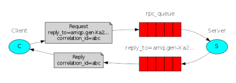

# NotesHub-CloudComputing
The project aims to easily manage several notes from a set of users. The user can perform three different functionalities:
* Create a new note
* Modify a note
* Delete a note
* Search for notes by author, date or subject

The application has been developed using a multi-tier architecture.

# Architecture

The user can interact with the application through a set of REST APIs. Mind that no UI has been currently developed, REST requests can be sent directly using the curl command. All the tiers have been dockerized during our testing.

 

## Load Balancer - HAProxy

The HAProxy Load Balancer manages and forwards the requests to a set of frontend servers using a Round Robin scheduling algorithm. 

 

## Frontend

Multiple frontend servers expose a set of REST APIs using the **Flask** framework. 

 

## Middleware - RabbiMQ
RabbitMQ has been employed as a communication interface between the frontend and the backend layers. The client sends a message containing an RPC (Remote Procedure Call) to be executed by the server, the latter is put in a queue by the RabbitMQ instance until the server is ready to accept it. The server then executes the request and publishes the result in another queue, specifying the client which must receive the response message.

## Backend - MongoDB

Notes are contained in a single MongoDB collection called "Notes". The following image shows the code used to insert a new note into the database:

## ZooKeeper

From the moment that in a cloud application each layer is time (same server may not be available at different times) and space (same server can be replaced, migrated and replicated at runtime) uncoupled, ZooKeeper is used to maintain updated informations on the active servers of each layer. At startup, each component requests the currently active servers and their "locations".
Parameter managed by the Zookeeper instance are: credentials, IP address and port of **RabbiMQ**; credentials, IP addreess and port of **MongoDB**; maximum length of notes, RabbitMQ maximum queue length.

# Contributors

@FilippoGuggino

@Baccios

@EmilioPaolini

@LucaBarsellotti